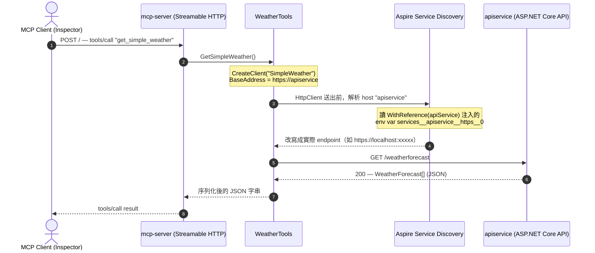
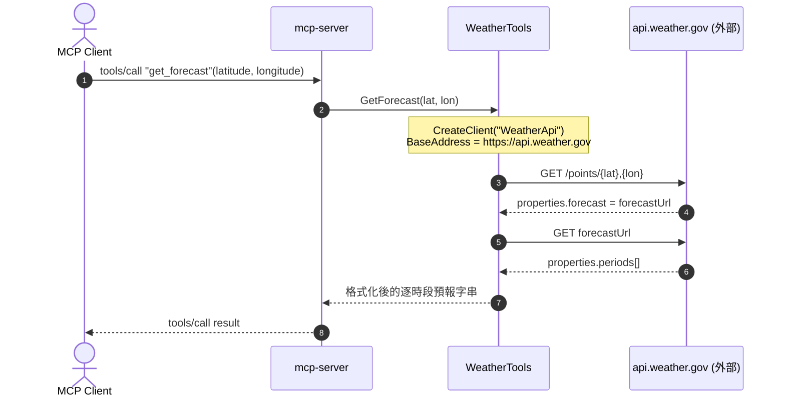
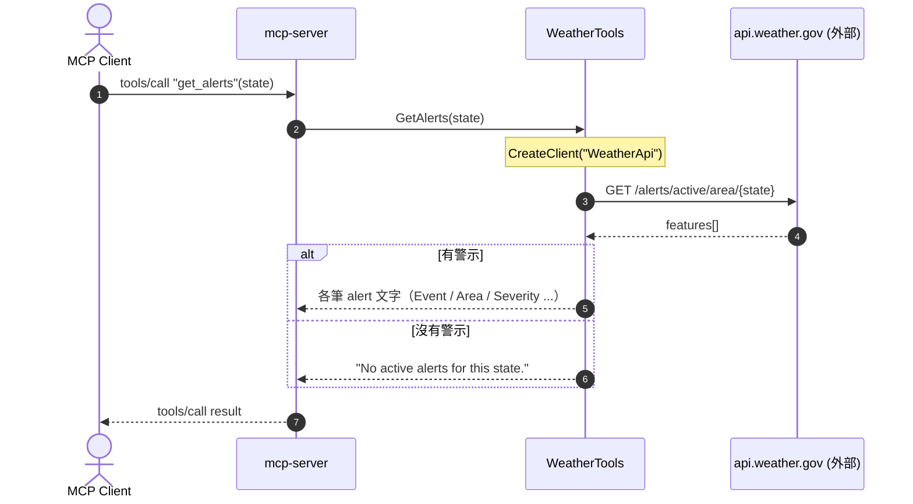

# Ch01 — Streamable HTTP MCP Server 的程式實作筆記（ASP.NET Core + Aspire）

對應課程 Module 1《Getting Started with the MCP SDK》的 *Demo: Creating an MCP Server (HTTP)*。
本篇聚焦「這支 HTTP 版 MCP server 怎麼組起來、呼叫時資料怎麼流動」，對象是 [Ch01.GettingStarted.Http](../../../src/Ch01.GettingStarted.Http/)。
延續 [ch01-stdio-implementation.md](ch01-stdio-implementation.md)，這次把 transport 從 **stdio** 換成 **Streamable HTTP**，並用 **.NET Aspire** 編排、測試整組服務。

參考範例：<https://github.com/modelcontextprotocol/csharp-sdk/tree/main/samples/AspNetCoreMcpServer>

---

## 目標

用 `ModelContextProtocol.AspNetCore` 把 MCP server 掛在 ASP.NET Core 上，透過 **Streamable HTTP** 對外提供 Weather 系列 tool；
再用 Aspire AppHost 把「MCP server + 後端 API + MCP Inspector」三個資源一起拉起來，在 Aspire Dashboard 裡直接連線測試與觀測。

---

## 專案結構

用 **Aspire Starter App** 範本建立 solution，範本會產生 4 個專案，本 lab 的取捨如下：

| 專案 | 角色 | 說明 |
| --- | --- | --- |
| `Hello.AspNetCoreMcp.AppHost` | Aspire 編排入口 | 定義並啟動所有資源；**啟動點就選這個**。 |
| `Hello.AspNetCoreMcp.McpServer` | MCP server | 由 **ASP.NET Core Empty** 範本另建，掛 Streamable HTTP transport 與 Weather tools。 |
| `Hello.AspNetCoreMcp.ApiService` | 後端 Web API | 範本內建，提供 `/weatherforecast`，當作 MCP tool 呼叫的下游服務。 |
| `Hello.AspNetCoreMcp.ServiceDefaults` | 共用設定 | Aspire 標配：service discovery、resilience、health check、OpenTelemetry。被各服務參考。 |
| ~~`Hello.AspNetCoreMcp.Web`~~ | （刪除） | 範本的 Blazor 前端，本 lab 用不到，直接移除。 |

> 命名對照專案慣例：solution folder 用 `Ch01.Hello.AspNetCoreMcp`，實體專案放在 `src/Ch01.GettingStarted.Http/`。

---

## 做法重點

### 1. MCP server：掛上 Streamable HTTP transport

`McpServer/Program.cs` 的服務註冊三步，對照 stdio 版只差在 transport 與宿主：

```csharp
builder.AddServiceDefaults();                 // 接上 Aspire 共用設定

builder.Services.AddMcpServer()               // 註冊 MCP server
    .WithHttpTransport()                       // 用 Streamable HTTP（取代 stdio）
    .WithTools<WeatherTools>();                // 明確註冊這個 tool 類別

var app = builder.Build();
app.MapDefaultEndpoints();                     // /health、/alive（Aspire health check）
app.MapMcp();                                  // 把 MCP endpoint 掛在根路徑 ""
app.Run();
```

- **`WithHttpTransport()`** 啟用 **Streamable HTTP** transport（MCP 目前的標準 HTTP 傳輸，取代舊的 HTTP+SSE）。
  預設是 **stateful**（每個 client 有 session，支援 server→client 的 sampling／elicitation）；
  若部署要水平擴充、不需回呼，可改 `WithHttpTransport(o => o.Stateless = true)`——本 lab 用預設即可。
- **`WithTools<WeatherTools>()`** vs stdio 版的 `WithToolsFromAssembly()`：這裡「指名」註冊單一 tool 類別，不掃整個組件。
- **`MapMcp()`** 預設把 MCP endpoint 掛在根路徑，所以 client 連 `http://<host>/` 即可（下面 Inspector 也是靠這點）。
- 不像 stdio 要把 log 導到 stderr——HTTP 宿主的 log 走一般 ASP.NET Core 管線，直接進 Aspire 的 structured logs。

### 2. Tools：instance class + 建構式注入

`Tools/WeatherTools.cs` 與 stdio 版最大的差別：它是**一般 class（非 static）**，透過**建構式注入 `IHttpClientFactory`**，方法內再去要具名 HttpClient。

```csharp
[McpServerToolType]
public sealed class WeatherTools
{
    private readonly IHttpClientFactory _httpClientFactory;
    public WeatherTools(IHttpClientFactory httpClientFactory) => _httpClientFactory = httpClientFactory;

    [McpServerTool, Description("Get current weather conditions for a location.")]
    public async Task<string> GetSimpleWeather() { /* 用 "SimpleWeather" client 打 /weatherforecast */ }

    [McpServerTool, Description("Get weather alerts for a US state.")]
    public async Task<string> GetAlerts([Description("...2 letter abbreviation...")] string state) { /* 用 "WeatherApi" */ }

    [McpServerTool, Description("Get weather forecast for a location.")]
    public async Task<string> GetForecast(double latitude, double longitude) { /* 用 "WeatherApi" */ }
}
```

> tool 類別由 DI 容器建構、可注入服務，這點在 [ch01-stdio-implementation.md](ch01-stdio-implementation.md#4a-tool-類別可以是實例類別由-di-容器建構) 已詳述；差別只在這裡注入的是 `IHttpClientFactory`。

共 3 個 tool。**tool 名稱由方法名自動轉成 snake_case**，所以對外看到的是：

| 方法 | 對外 tool 名稱 | 下游 | 測試輸入 |
| --- | --- | --- | --- |
| `GetSimpleWeather` | `get_simple_weather` | 內部 `apiservice`（`SimpleWeather` client） | 無參數 |
| `GetAlerts` | `get_alerts` | weather.gov（`WeatherApi` client） | `MN` / `OR` / `TX` |
| `GetForecast` | `get_forecast` | weather.gov（`WeatherApi` client） | `44.913579, -92.9329` |

### 3. 兩個具名 HttpClient，與 Aspire service discovery

`McpServer/Program.cs` 註冊了**兩個** named client：

```csharp
// 打真實外部 API
builder.Services.AddHttpClient("WeatherApi", c =>
{
    c.BaseAddress = new Uri("https://api.weather.gov");
    c.DefaultRequestHeaders.UserAgent.Add(new ProductInfoHeaderValue("weather-tool", "1.0"));
});

// 打 Aspire 內部服務（重點在這個位址）
builder.Services.AddHttpClient("SimpleWeather", c =>
    c.BaseAddress = new("https://apiservice"));
```

- `https://apiservice` 不是真實 DNS——`apiservice` 是 AppHost 裡的**資源邏輯名稱**。能連得上是靠 **Aspire service discovery**：
  1. AppHost 用 `.WithReference(apiService)` 把 apiservice 的實際 endpoint 以環境變數（`services__apiservice__https__0` 等）注入 mcp-server；
  2. `ServiceDefaults` 的 `AddServiceDefaults()` 對**所有** HttpClient 掛上 `AddServiceDiscovery()`，把 `apiservice` 這個 host 解析成真實位址。
- 同一段 `ConfigureHttpClientDefaults` 也預設加了 **standard resilience handler**（retry／timeout／circuit breaker），所以這兩個 client 免額外設定就有韌性。
- weather.gov 要求帶 `User-Agent`，否則會被拒——所以 `WeatherApi` 特地補了 `ProductInfoHeaderValue`。

> `ApiService` 回傳的 `WeatherForecast` 有計算屬性 `TemperatureF`；`WeatherTools` 端用 4 參數的 `record WeatherForecast(..., int TemperatureF)` 反序列化，靠 JSON 屬性名對應接得起來。

### 4. AppHost：編排三個資源 + 掛上 MCP Inspector

`AppHost/AppHost.cs`：

```csharp
var apiService = builder.AddProject<Projects.Hello_AspNetCoreMcp_ApiService>("apiservice")
    .WithHttpHealthCheck("/health");

var mcp = builder.AddProject<Projects.Hello_AspNetCoreMcp_McpServer>("mcp-server")
    .WithHttpHealthCheck("/health")
    .WithReference(apiService);                 // 讓 mcp-server 找得到 apiservice

builder.AddMcpInspector("mcp-inspector")
    .WithMcpServer(mcp, path: "");              // Inspector 直接指向 mcp-server 根路徑
```

- **`CommunityToolkit.Aspire.Hosting.McpInspector`** 套件提供 `AddMcpInspector()`：在 Dashboard 裡自動起一個 **MCP Inspector**，不用另外裝／開 npx。
- `WithMcpServer(mcp, path: "")` 的 `path: ""` 對應前面 `MapMcp()` 掛在根路徑——兩邊要一致，Inspector 才連得到。
- 兩個服務都掛 `WithHttpHealthCheck("/health")`，對應 `MapDefaultEndpoints()` 開的 health endpoint，Dashboard 會顯示健康狀態。

### 套件版本（集中式管理 CPM，見 [`Directory.Packages.props`](../../../Directory.Packages.props)）

- `ModelContextProtocol.AspNetCore` `0.3.0-preview.4`（McpServer）
- `Aspire.Hosting.AppHost` `9.3.1`、`CommunityToolkit.Aspire.Hosting.McpInspector` `9.8.0-beta.389`（AppHost）
- `Microsoft.AspNetCore.OpenApi` `9.0.2`（ApiService）

---

## 呼叫流程（Sequence Diagram）

三個 tool 的差別，關鍵在「HTTP 打去哪裡」：

- **`get_simple_weather`** 停在 **Aspire 應用邊界內**——靠 service discovery 把 `apiservice` 解析成內部服務，不出網。
- **`get_alerts` / `get_forecast`** 會**走出去打外部** `api.weather.gov`。

> 三張圖裡 `mcp-server` 與 `WeatherTools` 其實是同一個行程（前者是宿主、後者是被 DI 注入的 tool 類別），拆開只是為了看清職責。

### `get_simple_weather`：經 mcp-server → Aspire 內部 apiservice

這條路是「第一次用 Aspire」最想搞懂的重點。`SimpleWeather` client 的 `BaseAddress` 是 `https://apiservice`，
但 `apiservice` 不是真實 DNS——service discovery 會在 HttpClient 送出前，把它改寫成 AppHost 注入的實際位址。



### `get_forecast`：兩段呼叫打外部 weather.gov

先用座標問「這個點的預報 URL 是哪個」，再打第二次拿實際預報。



### `get_alerts`：一段呼叫打外部 weather.gov



---

## 測試方式

1. **啟動點選 `AppHost`** 執行，開啟 Aspire Dashboard。確認三個資源都是 **Healthy**：
   - `apiservice`
   - `mcp-server`
   - `mcp-inspector`
2. 在 Dashboard 點 **mcp-inspector** 的 endpoint 開啟 Inspector。
   > ⚠️ **用 Edge 開**——Chrome 開會是一片空白（踩雷筆記）。
3. Inspector 裡：**Transport Type 選 `Streamable HTTP`** → **Connect** → **List Tools**，應看到 3 個 tool。
4. 逐一試：

   | Tool | 輸入 | 預期 |
   | --- | --- | --- |
   | `get_simple_weather` | （無） | 回 apiservice 產生的 5 天假資料 JSON |
   | `get_forecast` | `latitude=44.913579`, `longitude=-92.9329` | 回該座標的逐時段預報 |
   | `get_alerts` | `MN` / `OR` / `TX` | 回該州目前的天氣警示，沒有則回 "No active alerts..." |

---

## 觀測（Aspire Traces）

到 Dashboard 的 **Traces** 頁，可看到每次 MCP 呼叫的完整 span。因為 `ServiceDefaults` 已開 `AddHttpClientInstrumentation()`，
可以看到一次 tool 呼叫的時間**大部分花在對下游 weather API 的 HTTP 存取**上——MCP 協定本身的開銷很小。這也直觀說明了 MCP server 常常只是「工具的門面」，真正的成本在它背後呼叫的服務。

---

## 常見踩雷速查

| 症狀 | 原因 / 解法 |
| --- | --- |
| Inspector 開起來是空白頁 | 用 Chrome 開會空白，改用 **Edge** |
| Inspector 連不上 mcp-server | Transport 要選 **Streamable HTTP**（別選成舊的 SSE）；且 Inspector 的 `path` 與 `MapMcp()` 都要在根路徑 `""` |
| `get_simple_weather` 連不到 apiservice | 少了 AppHost 的 `.WithReference(apiService)`，或 ServiceDefaults 沒開 service discovery，`https://apiservice` 就解析不了 |
| `get_alerts` / `get_forecast` 失敗 | 需要能連外（weather.gov），且 `WeatherApi` client 的 `User-Agent` 不可少 |
| 資源顯示 Unhealthy | 對應服務的 `/health` 沒通；確認 `MapDefaultEndpoints()` 有掛、服務有正常啟動 |

---

## 延伸

- 前一支 stdio 版的程式實作：[ch01-stdio-implementation.md](ch01-stdio-implementation.md)
- stdio 版的連線／測試操作手冊：[ch01-testing-mcp.md](ch01-testing-mcp.md)
- 專案原始碼：[src/Ch01.GettingStarted.Http/](../../../src/Ch01.GettingStarted.Http/)
