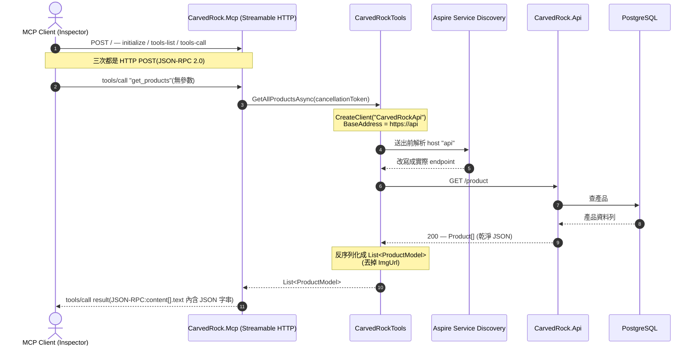

# Ch02 — 為 CarvedRock 建 API MCP Server 的程式實作筆記

對應課程 Module 2《Creating an MCP Server for APIs》,把前一章的 Hello World 練習搬到真實情境:
為虛構公司 **Carved Rock Fitness**(戶外運動器材電商)既有的解決方案,加上一支 MCP server,
讓 AI 能透過 tool 取用產品目錄。對象是 [`CarvedRock.Mcp`](../../../src/Ch02.CreatingMcpServer/CarvedRock.Mcp/) 專案。

> 📌 **命名對照**:solution 裡的資料夾顯示為 `Ch02.CreatingMcpServerForApi`,實體路徑在 `src/Ch02.CreatingMcpServer/`。
> 起始 app 的功能說明見 [專案 readme](../../../src/Ch02.CreatingMcpServer/readme.md);本篇只講「加上去的 MCP server」。
> 延續 [ch01-http-implementation.md](ch01-http-implementation.md) 的 Streamable HTTP + Aspire 基礎,共通細節不再重複。

---

## 情境:這章要做什麼

產品端提了一個功能需求:**在聊天介面用 AI 做產品推薦**——
使用者輸入想找什麼,AI 拿這段文字加上 Carved Rock 目錄裡的產品,給出簡單推薦。

我們(後端)這章要交付的第一塊:

1. 建一支 MCP server,提供一個能**回傳所有產品**的 tool。
2. (課程原本還要求自動化測試,本筆記依範圍**略過所有測試 demo**;測試專案在 [`src/Ch02.CreatingMcpServer/tests/CarvedRock.IntegrationTests/`](../../../src/Ch02.CreatingMcpServer/tests/CarvedRock.IntegrationTests/)。)

> Carved Rock 起始的 app 本身沒有任何 AI/MCP,是一個很簡單的電商:產品 CRUD API + 前端 WebApp +
> Aspire app host + 一堆 class library(Core/Data/Domain),登入走公開的 Duende IdentityServer demo。
> 這章只在它上面「加一支 MCP server」,不動原本的功能。

---

## 專案結構

Ch02 的 solution 比 Ch01 完整得多(是一個接近真實的電商 app),本篇只聚焦跟 MCP 有關的幾個:

| 專案 | 角色 | 這章的動作 |
| --- | --- | --- |
| `CarvedRock.Mcp` | **新增** 的 MCP server | 用 **ASP.NET Core Empty** 範本建,掛 Streamable HTTP,提供產品相關 tool。 |
| `CarvedRock-Aspire.AppHost` | Aspire 編排入口 | 加一行把 MCP server 納入編排;另外**掛上 MCP Inspector**。**啟動點就選這個**。 |
| `CarvedRock.Api` | 既有的產品 CRUD API | 不改,被 MCP tool 當下游呼叫(`/product` controller)。 |
| `CarvedRock-Aspire.ServiceDefaults` | Aspire 共用設定 | service discovery、resilience、health check、OpenTelemetry;被 MCP server 參考。 |
| `mcp-inspector` | 手動互動用戶端 | 由 `CommunityToolkit.Aspire.Hosting.McpInspector` 套件加進 app host。 |

> 其餘 `CarvedRock.Core / .Data / .Domain / .WebApp / MailKit.Client` 是起始電商 app 的一部分,與本篇 MCP 主題無直接關係。

---

## 做法重點

### 1. AppHost:把 MCP server 納入編排 + 掛 Inspector

[`CarvedRock-Aspire.AppHost/Program.cs`](../../../src/Ch02.CreatingMcpServer/CarvedRock-Aspire.AppHost/Program.cs)(節錄與 MCP 有關的部分):

```csharp
var api = builder.AddProject<Projects.CarvedRock_Api>("api")
    .WithReference(carvedrockdb)
    .WaitFor(carvedrockdb)
    .WithHttpHealthCheck("/health");

var mcp = builder.AddProject<Projects.CarvedRock_Mcp>("mcp")   // 接住回傳,供 Inspector 引用
    .WithReference(api)                                         // MCP server 要呼叫 API,先給它 reference
    .WithHttpHealthCheck("/health");

builder.AddMcpInspector("mcp-inspector")
    .WithMcpServer(mcp, path: "");                              // Inspector 指向 mcp 的根路徑
```

- **`WithReference(api)`** 讓 MCP server 靠 **Aspire service discovery** 找得到 API(同 Ch01 的機制)。
- **MCP Inspector** 由 `CommunityToolkit.Aspire.Hosting.McpInspector` NuGet 套件提供 `AddMcpInspector()`,
  直接在 Dashboard 內起一個 Inspector 資源(不必自己另外用 npx 手動開)。
- `WithMcpServer(mcp, path: "")` 的 `path: ""` 要與下方 `MapMcp()` 的根路徑一致,Inspector 才連得到
  (Ch01 踩過這雷:路徑對不上 Inspector 會連不上)。
- 這個 app host 還編排了 `postgres` 資料庫、`webapp` 前端與 `smtp`(MailPit),都屬起始 app,MCP 不依賴它們。

### 2. MCP server 的 `Program.cs`:註冊 MCP + HTTP transport + API client

先加 `ModelContextProtocol.AspNetCore`(prerelease,ASP.NET Core 版)。
[`CarvedRock.Mcp/Program.cs`](../../../src/Ch02.CreatingMcpServer/CarvedRock.Mcp/Program.cs) 全文其實很短:

```csharp
var builder = WebApplication.CreateBuilder(args);

builder.AddServiceDefaults();                       // Aspire 共用設定(含 OpenTelemetry、health check)

builder.Services.AddMcpServer()
    .WithHttpTransport()                             // Streamable HTTP transport
    .WithTools<CarvedRockTools>()                    // 讀取類 tool(get_products / get_single_product)
    .WithTools<AdminTools>();                        // 管理類 tool(delete_product / set_product_price)

builder.Services.AddHttpClient("CarvedRockApi", client =>
{
    client.BaseAddress = new Uri("https://api");    // 打 app host 裡的 api 資源(注意用 HTTPS)
});

var app = builder.Build();
app.MapDefaultEndpoints();                           // /health、/alive
app.MapMcp();                                        // MCP endpoint 掛在根路徑(不指定 path)
app.Run();
```

- `https://api` 不是真實 DNS,是 app host 裡 API 資源的**邏輯名稱**(`AddProject<...>("api")` 的那個 `"api"`),
  靠 service discovery 解析——**要用 `https://`** 對應 app host 對外開的 HTTPS endpoint,寫成 `http://` 會連不上。
- `AddMcpServer()` 之後**一定要接 `.WithTools<...>()`**(或其他註冊方式),否則 tool 不會被登錄,
  Inspector 連得上但 List Tools 會是空的。這裡用**兩個 `.WithTools<T>()` 串接**,分別註冊兩個 tool 類別。
- `MapMcp()` 取代範本原本的 `MapGet("/", ...)`,把 MCP 掛在根路徑。

### 3. `CarvedRockTools`:讀取類 tool

[`CarvedRock.Mcp/CarvedRockTools.cs`](../../../src/Ch02.CreatingMcpServer/CarvedRock.Mcp/CarvedRockTools.cs),
類別上加 `[McpServerToolType]`,主建構式注入 `IHttpClientFactory` 與 `ILogger<CarvedRockTools>`:

```csharp
[McpServerToolType]
public class CarvedRockTools(IHttpClientFactory httpClientFactory,
    ILogger<CarvedRockTools> logger)
{
    [McpServerTool(Name = "get_products"), Description("Get a list of all available products.")]
    public async Task<List<ProductModel>> GetAllProductsAsync(CancellationToken cancellationToken = default)
    {
        var client = httpClientFactory.CreateClient("CarvedRockApi");
        var response = await client.GetFromJsonAsync<List<ProductModel>>("/product", cancellationToken);
        logger.LogInformation("Fetched {Count} products", response?.Count ?? 0);
        return response ?? [];
    }

    // 注意這句課程原註解:別把 API 的每個方法都做成 tool,只加你「打算讓 AI 用」的
    [McpServerTool(Name = "get_single_product"), Description("Get a single product based on an Id.")]
    public async Task<ProductModel?> GetProductAsync(int id, CancellationToken cancellationToken = default)
    {
        var client = httpClientFactory.CreateClient("CarvedRockApi");
        return await client.GetFromJsonAsync<ProductModel>($"/product/{id}", cancellationToken);
    }
}
```

要點:

- **下游端點是 `/product`(單數)**——API 是 `[Route("[controller]")]` 的 `ProductController`,所以路由是 `/product`
  與 `/product/{id}`,**不是** `/products`(這是很容易寫錯的地方)。
- 注入的是 **`IHttpClientFactory`**(不是 `HttpClient`),方法內再 `CreateClient("CarvedRockApi")` 拿具名 client。
- 方法都是 **async、帶 `CancellationToken`**;回傳型別是自訂的 `ProductModel`(見下)。
- **`[McpServerTool(Name = "...")]`** 用 `Name` 覆蓋方法名——對外看到的是 `get_products` / `get_single_product`,
  不是 `GetAllProductsAsync` / `GetProductAsync`。`Description` 需要 `using System.ComponentModel;`。

### 4. `ProductModel`:在 MCP 端「重塑」回傳型別

[`CarvedRock.Mcp/ProductModel.cs`](../../../src/Ch02.CreatingMcpServer/CarvedRock.Mcp/ProductModel.cs)
是一個**只留 AI 需要的欄位**的 class:

```csharp
public class ProductModel
{
    public int Id { get; set; }
    public string Name { get; set; } = null!;
    public string Description { get; set; } = null!;
    public double Price { get; set; }
    public string Category { get; set; } = null!;
}
// 刻意「不含」ImgUrl —— AI 用不到圖片網址,就不塞給它
```

> 這是本章第一個「tool 不是照搬 API 回傳」的例子:在 MCP 端塑形成剛好夠用的形狀。
> 對照之下,`AdminTools` 改價時用的是**含 `ImgUrl` 的完整版** `FullProductModel`(見下)——
> 背後的設計理由(讀取路徑瘦身、寫入路徑要完整)整理在 [ch02-tool-design-notes.md](ch02-tool-design-notes.md)。

### 5. `AdminTools`:管理類 tool(delete / set price)

[`CarvedRock.Mcp/AdminTools.cs`](../../../src/Ch02.CreatingMcpServer/CarvedRock.Mcp/AdminTools.cs) 另外提供兩個 tool:

| 對外 tool 名稱 | 方法 | 下游呼叫 |
| --- | --- | --- |
| `delete_product` | `DeleteProductAsync(int id)` | `DELETE product/{id}` |
| `set_product_price` | `UpdateProductPriceAsync(int id, double newPrice)` | 先 `GET product/{id}`(取 `FullProductModel`),改價後 `PUT product/{id}` |

- `set_product_price` 是「**先讀完整物件、改一個欄位、再整包 PUT 回去**」的模式,所以它用**含 `ImgUrl` 的
  `FullProductModel`**(record),而不是瘦身版 `ProductModel`——PUT 需要把完整物件送回。若新價與現價相同會回 `"not changed"`。
- 回傳都是自訂的 `OperationResult(Status, Message?)` record。

> ⚠️ **關於安全性(這章的重要邊界)**:在 Ch02 這個快照裡,`AdminTools` **沒有任何 `[Authorize]`**,
> MCP server 也**還沒設定任何驗證**——這兩個 tool 就這樣被 `.WithTools<AdminTools>()` 平白註冊、任何人都列得到、叫得到。
> 但它們打的 **API 端點**(`POST/PUT/DELETE /product`)在 `ProductController` 上是 `[Authorize(Roles = "admin")]`;
> 而 Ch02 **沒有把 bearer token 轉發**給 API,所以呼叫會抵達 API 卻**沒有 `Authorization` 標頭 → 回 401**。
> 「為 MCP 加驗證、依角色過濾 tool、把 token 轉發給 API」是 **Module 3(安全性)** 的內容,待該章另開筆記。

### 套件版本(集中式管理 CPM,見 [`Directory.Packages.props`](../../../Directory.Packages.props))

- MCP server:`ModelContextProtocol.AspNetCore` **0.4.0-preview.2**(比 Ch01 的 `0.3.0-preview.4` 新)。
- app host:`CommunityToolkit.Aspire.Hosting.McpInspector` **9.8.0**、`Aspire.Hosting.AppHost` **9.5.1**。
- `csproj` 的 `PackageReference` 不帶版本,版本集中在 `Directory.Packages.props`。

---

## 加 tool 的四種方式(Options for Adding Tools)

> 核心提醒:**tool 給 AI 太多會讓它混亂**——叫錯 tool、或乾脆不叫。只加「該加的」很重要
> (`CarvedRockTools` 裡那句「別把 API 每個方法都做成 tool」正是這個道理)。

| 方式 | 怎麼運作 | 何時用 |
| --- | --- | --- |
| **`WithToolsFromAssembly()`** | 用反射掃組件,找 `[McpServerToolType]` 類別裡的 `[McpServerTool]` 方法。無參數=掃呼叫端組件,也可指定組件名。 | 想「一次全加」;Ch01 stdio 版用的就是這個。 |
| **`WithTools<T>()`** | 指定型別,找該類別裡有 `[McpServerTool]` 的方法。**類別層級的 `[McpServerToolType]` 對這個方式不是必要的**(本章仍加它,只為與其他方式一致、也方便日後改用掃組件)。 | 只想加某些類別。**本章用兩個 `.WithTools<T>()` 串接**(`CarvedRockTools` + `AdminTools`)。 |
| **`WithTools(...)` 帶清單** | 傳一組 `IEnumerable` 的 tool 方法(不給泛型型別),每個方法要有 `[McpServerTool]`。 | 想精挑細選到「方法」層級。 |
| **`ConfigureSessionOptions`** | 進階:在 session 層動態算出可用 tool 清單。 | 依授權情境決定露出哪些 tool(Module 3 安全性會用到)。 |

- 這幾種**可以組合使用**(本章就是把 `WithTools<T>()` 用了兩次)。
- 之後改用「授權過濾 + 掃組件」的組合是很常見的演進(下一章)。

---

## MCP 的請求／回應長怎樣(JSON-RPC 2.0)

在 Inspector 的 **History** 區可以看到每個動作其實都是一次 **HTTP POST**,底層走 **JSON-RPC 2.0**。
三個關鍵訊息:

| 動作 | 觸發時機 | request `method` | response 重點 |
| --- | --- | --- | --- |
| `initialize` | 按 **Connect** | `initialize` | 回 `capabilities`(含 `tools` 節點,表示 tool 清單有變動)+ server 資訊 |
| `tools/list` | 按 **List Tools** | `tools/list`(`params` 空物件) | 回 `tools` 陣列,每個含 `name`／`description`／`inputSchema`;`get_products` 無參數,schema 是「沒有屬性的 object」;`get_single_product` 則有一個 `id` 參數 |
| `tools/call` | 按 **Run** | `tools/call`(`params.name` = tool 名,`arguments` 帶參數) | 回 `content` 陣列,第一筆 `type: text`,`text` 就是 API 來的 JSON 字串 |

**關鍵觀念:MCP 的回應「不等於」API 的回應。**
API 直接打(Swagger)回的是**乾淨的 JSON 陣列**;MCP 回的是 JSON-RPC 包裝、`content[].text` 裡塞一段
**跳脫過雙引號的 JSON 字串**。這是刻意的設計——你從 MCP tool 回什麼、怎麼包,取決於 AI 服務最好消化的形式。

```jsonc
// tools/call "get_products" 的 response(簡化)
{
  "jsonrpc": "2.0",
  "result": {
    "content": [
      { "type": "text", "text": "[{\"id\":1,\"name\":\"...\",\"price\":74.99,\"category\":\"boots\"}, ...]" }
    ]
  }
}
```

> Inspector 的 History 會把 response 內容截斷,完整內容看該筆的 **Tool Result** 區;Postman 的 **Preview** 分頁也比較好讀。

---

## 呼叫流程(Sequence Diagram)

`get_products` 的路徑停在 **Aspire 應用邊界內**:MCP server 靠 service discovery 把 `api` 解析成內部服務,不出網。



---

## 手動測試(Aspire Dashboard + MCP Inspector)

> 本章只做**手動**驗證;課程的自動化測試 demo 依範圍略過。

1. **啟動點選 `CarvedRock-Aspire.AppHost`** 執行,開啟 Aspire Dashboard,確認資源都 **Healthy**
   (與 MCP 有關的至少是 `api`、`mcp`、`mcp-inspector`;首次跑要等 Postgres 映像下載)。
2. 點 **mcp-inspector** 的連結開啟 Inspector。
   > ⚠️ Inspector 用 **Edge** 開比較穩(Ch01 踩過 Chrome 開空白的雷)。
3. Inspector:Transport 選 **Streamable HTTP** → **Connect** → **List Tools**,應看到四個 tool
   (`get_products`、`get_single_product`、`delete_product`、`set_product_price`)。
4. 選 `get_products` → **Run**(無需輸入參數)→ 結果區應看到產品清單 JSON。
5. 試 `delete_product` / `set_product_price` 會**失敗(401)**——因為還沒轉發 token 給要求 admin 的 API(見上方安全性邊界)。
6. 到 Dashboard **Traces** 頁,可看到這次呼叫的 span:MCP server → API → DB;所有對 MCP server 的呼叫都是 **POST**。

---

## 常見踩雷速查

| 症狀 | 原因 / 解法 |
| --- | --- |
| tool 呼叫回 404 / 找不到端點 | 下游路由是 **`/product`(單數)**,不是 `/products`;`ProductController` 是 `[Route("[controller]")]` |
| Inspector 連得上但 **List Tools 是空的** | `AddMcpServer()` 後忘了接 `.WithTools<...>()` |
| Inspector 連不上 mcp | Transport 要選 **Streamable HTTP**;且 Inspector 的 `path` 與 `MapMcp()` 都要在根路徑 `""` |
| tool 呼叫時連不到 API | HttpClient 的 `BaseAddress` 要用 **`https://api`**(HTTPS + app host 的邏輯名),且 app host 有 `.WithReference(api)` |
| `delete_product` / `set_product_price` 回 **401** | 預期行為:API 端點要求 `admin` 角色,Ch02 還沒轉發 token —— 屬 Module 3 |
| 對外看到的 tool 名稱是方法名 | 沒設 `[McpServerTool(Name = "...")]`,對外就會用方法名 |
| `Description` 編譯不過 | 少了 `using System.ComponentModel;` |

---

## 延伸

- 為什麼 tool 要「塑形」回傳(`ProductModel` vs `FullProductModel`)、還能塞哪些邏輯,以及 logging/tracing 怎麼設:[ch02-tool-design-notes.md](ch02-tool-design-notes.md)
- 前一章的 HTTP 版程式實作(共通的 transport / service discovery 細節):[ch01-http-implementation.md](ch01-http-implementation.md)
- 安全性(OAuth、依角色過濾 tool、token 轉發,讓 `delete_product` / `set_product_price` 能成功)屬 Module 3,待該章另開筆記。
